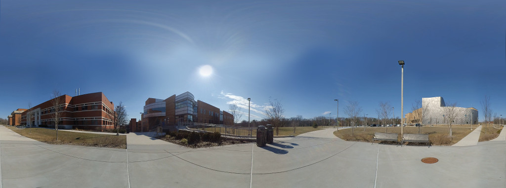
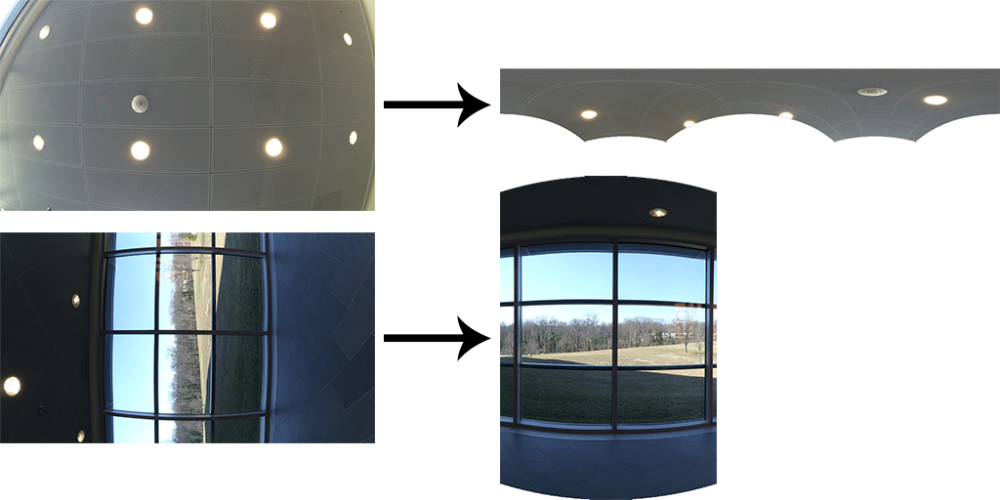

#360warper

A standalone image/video warper created to be used with video compositing tools like After Effects, Blender, Nuke etc. to create 360 video.

Transforms raw footage from camera to correct projection onto a spherical/equirectangular map for 360 video. Shown below is an example of projection to the top/north pole and projection to side/equator of the 360 viewing sphere.

Executables and warper script is available to download for:  
[macOS64](https://mega.nz/#!5UUGCYzC!riW7KApZu_tcmvv7iLBDX5ToDQJTHDBUizHfy2Ga2bs)  
[Win64](https://mega.nz/#!QY81lZrK!gdPLD3h7vp4k75xlDRuZmhUMljWqKGRqeY87K5DeIPQ)  

To see the accompanying YouTube tutorial visit:
https://www.youtube.com/watch?v=F78drmyd21I

To run warper, open a terminal and change to directory (`cd` command) containing all necessary files i.e.

    warp.py
    360warper
    settings.txt
    ffmpeg (3.2.4 included here, visit ffmpeg.org for more info)
    < Any image/video files to warp >(.mp4, .jpg, .png)

Confirm and change parameters in `settings.txt` file for desired use.

When ready to warp images/videos, type in the terminal command:

    ./warp.py video1.mp4 video2.mp4 checkerboard.jpg ...

Warping process will run. May take some time.

Process will automatically create and delete a temporary working directory called `/temp` in the same directory.

Warped videos will be saved as `originalName_warped.mp4` in same directory

Warped images will be saved as `originalName_warped.jpg` in same directory

Lens distortion correction can also be handled by `360warper`. Use the presets in the `settings.txt` file or experimentally determine the correct distortion for desired camera by taking images of several checkerboards and tweaking the distortion settings in the `settings.txt` file until it looks acceptable.

<h3> // TODO </h3>
* Pipeline and multi-thread the code more for CPU
* Implement GPU version
* Learn ffmpeg and avlib and interface directly with warper program to replace the current random python hack.
