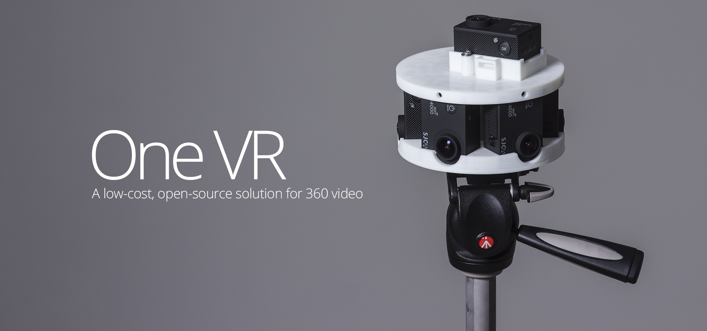
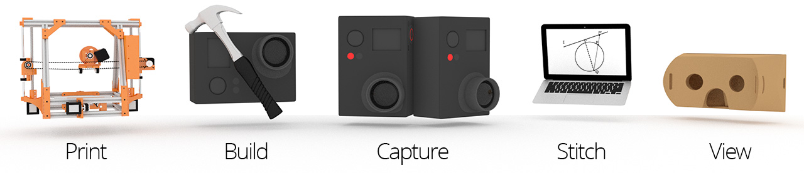
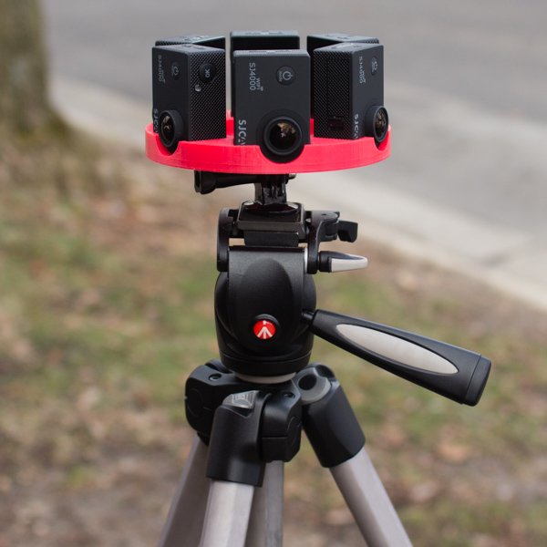
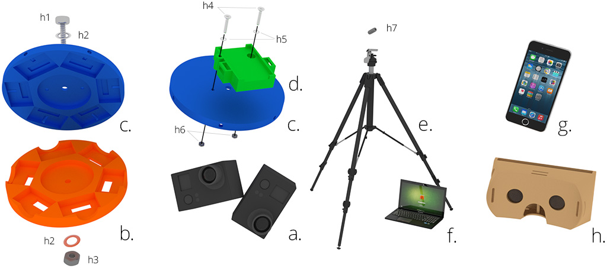
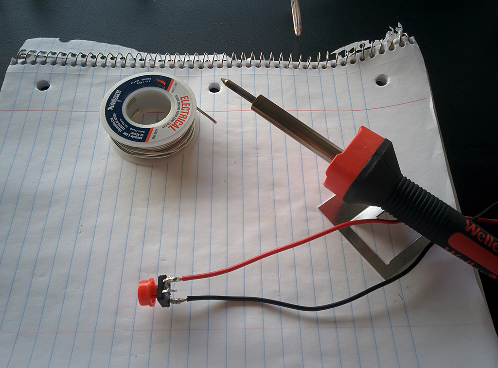

# One VR

<h3> A low-cost, DIY, end-to-end 360/VR solution concept </h3>

A virtual reality, 360 camera system along with a cross-platform (iOS & Android) mobile VR viewer application, forms an end-to-end VR solution; from capture to viewing.

Designs based around using off-the-shelf hardware/software. Parameterized 3D model files allow for easy generation of camera mounts to fit most small, rectangular cameras like GoPro, SJCAM, Xiaomi and NoPro.

Project started Spring break 2015 with some good friends and further developed through a Computational Photography class, CS 534, and hardware resources/funding by Garage Physics at University of Wisconsin, Madison.

<h3> Pipeline </h3>

<h3> Directories </h3>

`/cam` - 3D printable 360 camera rig files (`.stl`), generator files (`.scad`) and camera control commands  
`/cpp` - Automated video stitching (in development, see video tutorial below for manual solution)  
`/doc` - Documentation and reference images  
`/mlab` - MATLAB prototype for a basic panorama stitching algorithm from a class, for learning and reference  
`/viewer` - Basic VR 360 video/image player for web browsers

<h3> Multi-camera system overview </h3>

Version 2 left, pictured without upper mount. Version 3 on right with optional top camera expansion module.

Captures monoscopic video in 360 degrees horizontal and ~135 degrees vertical. Six individual streams are stitched and blended together into a cohesive panoramic video.

6 SJ4000 cameras arranged outwards is just barely enough information to create a 360 video and requires a decent amount of user input to stitch in After Effects. Using 5 SJ4000 cameras seated horizontally would help automated stitching a lot at the cost of some vertical field of view. Using more cameras is ideal, but drives up cost and requires a more powerful computer for stitching. Modifying lenses of the cameras with wider angle replacements is also a solution. If planning to build with SJ4000s oriented vertically, using 7 cameras is probably a safer option.

[4K Demo Footage](https://www.youtube.com/watch?v=a_FUM7AA19g)

<h3> Bill of Materials - Hardware & Software </h3>
Listed below are items I have tested but any of them can be swapped out with other items that serve a similar purpose. Search [3DHubs](https://www.3dhubs.com) to find access to a nearby 3D printer. Some libraries have printers as well. Or build your own [RepRap](http://www.reprap.org) as a support project.

<h5> Hardware </h5>

<b>a.</b> 6 or more SJ4000 action cameras (~$60 each), Alternatives include GoPro, Xiaomi (may need to modify 3D models). Can use less cameras by replacing stock lenses with wide angle lenses for Xiaomi and SJ4000.
 
<b> b. </b> A lower bracket/apparatus to seat cameras. Modify existing CAD designs in `/cam` directory to meet camera choice.
 
<b> c. </b> A matching upper apparatus to secure cameras. Likewise, modify existing CAD designs in `/cam` directory to meet camera choice.
 
<b> d. </b> (Optional) Zenith module for housing a single additional zenith camera i.e. "Sky Camera."
 
<b> e. </b> Standard Tripod
 
<b> f. </b> Standard computer, relatively powerful GPU for image processing preferred
 
<b> g. </b> Any mobile device with a modern web browser
 
<b> h. </b> A headmounted display to house mobile device for VR viewing like [Cardboard](https://www.google.com/get/cardboard/) or print one from [Thingiverse](http://www.thingiverse.com/search?q=vr+headset).

<b> h1 </b> - 1x 1/4"-20 bolt for securing top mount to bottom mount. For SJ4000s, length of bolt must be > 3". May be different for other camera selections. Ideally, choose a length that allows bolt to stick past bottom mount an inch or two to connect to tripod with coupling bolt 'h7.'
 
<b> h2 </b> - 2x Washers for 1/4"-20 bolt.
 
<b> h3 </b> - 1x 1/4"-20 nut for tightening under bottom mount.

<i>h4 - h6 only applies if using top camera module</i>
 
<b> h4 </b> - 2x 6-32 screws (> 1.5" length) to mount top camera expansion module.
 
<b> h5 </b> - 4x #6 washers.
 
<b> h6 </b> - 2x 6-32 nuts.

<b> h7 </b> - 1x 1/4"-20 coupling nut for joining entire setup to tripod head.

(Optional) Switch to gen-lock/sync record controls for cameras, necessary to mitigate rolling shutter when capturing scenes with fast motion, also provides convenience for starting/stopping recording, requires soldering

<h5> Software list </h5>
 * [OpenSCAD](http://www.openscad.org) for rapid, parameterized prototyping of 3D printable VR camera mounts (Free)
 * [After Effects CC](http://www.adobe.com/products/aftereffects.html) for basic stitching using warp plugins (Free 30-day trial, then monthly subscription)
 * (Optional) Stitching plugins for After Effects like [Skybox Mettle](http://www.mettle.com/product/skybox/), [PTGui](https://www.ptgui.com/), [Kolor](http://www.kolor.com/) or [VideoStitch](http://www.video-stitch.com/) for professional stitching results (> $90)
 * [Blender](https://www.blender.org/) for alternative stitching method to After Effects, also includes capabilites to composite text and 3D. (Free)
 * [YouTube 360 Injector](https://support.google.com/youtube/answer/6178631?hl=en) for tagging proper metadata to final 360 video for properly uploading to YouTube (Free)
 * (Optional) [OpenCV](http://opencv.org/) for determining relative positioning between video streams, for developing `/cpp` (Free)

<h3> Stitching Techniques</h3>
[Video Tutorial: After Effects](https://www.youtube.com/watch?v=5elOFvyL4KA)  
Compile and run OpenCV stitcher in `\cpp` (Currently only works for image sequences)

<h3> Viewing </h3>
Web VR 360 Player - [Demo Link](https://cdn.rawgit.com/felixtsao/oneVR_devel/master/viewer/index.html)

Visit `/viewer` directory for usage and source code.

<h3> 3D Printing </h3>

Print camera mount yourself or find a local printer through [3DHubs](https://www.3dhubs.com) or the local library.

Older version of `mono_lower_6x_sj4000.stl` printed on a Makerbot Replicator 2 with Red PLA. The mount takes about 4 hours to print if things go smoothly! Newer version of mount printed on an open-source Prusa i3 design, right, with a layer height of 0.27mm through a 0.4mm extruder nozzle.

<h5> Creating a new camera mount </h5>
Files are located in `/cam` directory, organized by camera model. To create a new camera mount, open the closest existing `.scad` file and adapt it by changing the camera trench dimensions. Camera dimensions are listed as variables at the top of the `.scad` files and should globally change the trench sizes across the mount. To add more cameras, simply increase the distance of the optical center and make additional copies of the trenches and assign each trench with the appropriate angle. The numbers are technically unitless but they default to millimeter for most printers. Be sure to add 1 to the value used for the camera dimension for a little breathing room.

<h3> // TODO </h3>
 * Create automated video stitching template using OpenCV, C++ 
 * Top/bottom camera transform for AFX stitch method using Blender or script 
 * <strike>Make video tutorial for hand-stitching 360 videos in AFX</strike>
 

<h3> Technical References </h3>
1) [Course: Computational Photography CS534, UW-Madison, Dyer](http://pages.cs.wisc.edu/~dyer/cs534/)  
2) [Text: Chapter 9, Computer Vision, Szeliski](http://szeliski.org/Book/)  
3) [Paper: ORB Feature Descriptor, Rublee](http://www.vision.cs.chubu.ac.jp/CV-R/pdf/Rublee_iccv2011.pdf)  
4) [Docs: OpenCV](http://docs.opencv.org/3.1.0/)  
5) [Docs: ThreeJS](https://threejs.org/)  
6) [Docs: RepRap](http://www.reprap.org/)
