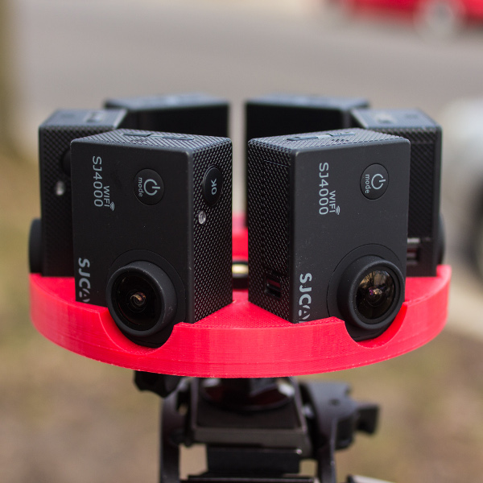

# One VR
<h3> A low-cost, DIY, end-to-end 360/VR solution concept </h3>

A virtual reality, 360 camera system along with a cross-platform (iOS & Android) mobile VR viewer application, forms an end-to-end VR solution; from capture to viewing.

Designs based around using off-the-shelf hardware/software. Parameterized 3D model files allow for easy generation of camera mounts to fit most small, rectangular cameras like GoPro, SJCAM, Xiaomi and NoPro.

Project started from a Computational Photography class (CS 534) and funding for hardware by Garage Physics at University of Wisconsin, Madison.

<h3> Pipeline </h3>

<h3> Directories </h3>

`/cam` - 3D printable 360 camera rig files (`.stl`), generator files (`.scad`) and camera control commands  
`/cpp` - Automated video stitching (in development / incomplete)  
`/mlab` - MATLAB prototype for a basic panorama stitching algorithm from a class, for learning and reference  
`/viewer` - Basic VR 360 video/image player, specify video/image source and projection type in `viewer.js` or rename video to `/video/src.mp4`, then launch `index.html` in a web browser (tested with Chrome and Firefox)

<h3> Bill of Materials - Hardware/Software </h3>
Listed below are items I have tested but any of them can be swapped out with other items that serve a similar purpose.

<h5> Hardware list </h5>
 * 6 or more SJ4000 action cameras (~$85 each), Alternatives include GoPro, Xiaomi (may need to modify 3D models)
 * 3D printable circular camera mount (Cost varies on accessibility to 3D printer, find a local center at [3DHubs](https://www.3dhubs.com))
 * Standard Tripod
 * Standard computer, relatively powerful GPU for image processing preferred
 * (Optional) Switch to gen-lock/sync record controls for cameras, necessary to mitigate rolling shutter when capturing scenes with fast motion, also provides convenience for starting/stopping recording, requires soldering (<$20)

<h5> About the multi-camera system </h5>
Captures monoscopic video in 360 degrees horizontal and ~170 degrees vertical. Six individual streams are stitched and blended together into a cohesive panoramic video. Top lid for camera mount not pictured.

 6 SJ4000 cameras arranged like the picture below is just barely enough information to create a 360 video and requires a decent amount of user input to stitch in After Effects. Using 6 SJ4000 cameras seated horizontally would help automated stitching a lot at the cost of some vertical field of view. Using more cameras is ideal, but drives up cost and requires a more powerful computer for stitching. Modifying lenses of the cameras with wider angle replacements is also a solution.

[2K Demo Footage](https://www.youtube.com/watch?v=lM7lKqry0ZM)

<h5> Software list </h5>
 * [OpenSCAD](http://www.openscad.org) for rapid, parameterized prototyping of 3D printable VR camera mounts (Free)
 * [After Effects CC](http://www.adobe.com/products/aftereffects.html) for basic stitching using warp plugins (Free 30-day trial, then monthly subscription)
 * (Optional) Stitching plugins for After Effects like [Skybox Mettle](http://www.mettle.com/product/skybox/) for professional stitching results ($99)
 * [Blender](https://www.blender.org/) for alternative stitching method to After Effects, also includes capabilites to composite text and 3D. (Free)
 * [YouTube 360 Injector](https://support.google.com/youtube/answer/6178631?hl=en) for tagging proper metadata to final 360 video for properly uploading to YouTube (Free)
 * (Optional) [OpenCV](http://opencv.org/) for determining relative positioning between video streams, for developing `/cpp` (Free)

<h5> Stitching Techniques</h5>
[Video Tutorial: After Effects](https://www.youtube.com/watch?v=5elOFvyL4KA)  
Blender Method coming soon  
*Other techniques in development

<h5> Web VR 360 Player </h5>
[Demo Link](https://cdn.rawgit.com/felixtsao/oneVR_devel/master/viewer/index.html) - Source code located in `/viewer`

<h4> Exhibit: An Extended Mobile Application Prototype </h4>

<h5> Mobile application description </h5>
Exhibit is a hybrid, cross-platform mobile application that explores the new and exciting virtual reality experience of viewing homes, apartments and new properties. With a few swipes, users can navigate an intuitive search feature and instantly find themselves standing in the room they want to see via photosphere or videosphere. Users can look around as if they're actually at the property which is made possible through the sophisticated use of gyroscopic sensors and projective geometry. For sellers, adding or modifying listings happens instantly and easily through a Parse database. From home owners to budding and mature businesses, Exhibit aims to bring the best places, to the best people, in the best way. Made with some cool friends.

<h5> To preview the app </h5>
Visit [exhibit.felixtsao.com](https://exhibit.felixtsao.com) on a smartphone web browser

<h3> 3D Printing </h3>

Print camera mount yourself or find a local printer through [3DHubs](https://www.3dhubs.com)

`mono_lower_6x_sj4000.stl` printed on a Makerbot Replicator 2 with Red PLA. The mount takes about 4 hours to print if things go smoothly! Messed up twice 1/4 of the way in on a Rostock Max V2 as the mount is relatively large for that printer's heatbed and would begin curling at the edges from non-uniform heating or something.

<h5> Creating a new camera mount </h5>
Files are located in `/cam` directory, organized by camera model. To create a new camera mount, open the closest existing `.scad` file and adapt it by changing the camera trench dimensions. Camera dimensions are listed as variables at the top of the `.scad` files and should globally change the trench sizes across the mount. To add more cameras, simply increase the distance of the optical center and make additional copies of the trenches and assign each trench with the appropriate angle. The numbers are technically unitless but they default to `mm` for most printers. Be sure to add 1 to the value used for the camera dimension for a little breathing room.

<h3> // TODO </h3>
 * Automate video stitching process using OpenCV, C++ 
 * Create stitching template and tutorial for using Blender  
 * Document gen-lock trigger hardware
 * <strike>Make video tutorial for hand-stitching 360 videos in AFX</strike>
<h4>Bugs:</h4>
`Report bugs here`
