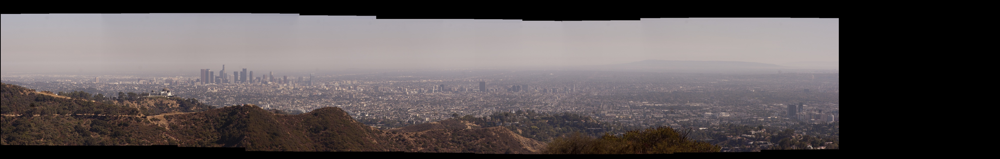

# Radial Stitcher (radStitch)



A simple panorama stitcher. Assumes input images are taken from radially symmetric viewpoints relative to common optical center. Uses OpenCV feature description to generate matching landmarks between adjacent images. Requires OpenCV to be installed. Works with OpenCV 3.1.0 installed on Ubuntu 16.04

<h3> Brief Usage </h3>
To compile, make sure OpenCV is installed, and with a terminal, navigate to directory with `main.cpp` and `CMakeList.txt` run:
```
make
```
After compilation, to stitch image, in terminal run:
```
./radStitch <image1> <image2> ... <imageN>
```
<p>
Current constraints:
<br>
Neighboring images specified in command line need to have an overlapping region i.e. <imageK> and <imageK+1> must share an overlapping region

<h3> // TODO </h3>
Currently works with images, will need to extend to video using `ffmpeg` or something
<br>
Need to implement 360 wraparound and polar wraparound
<br>
3D?
