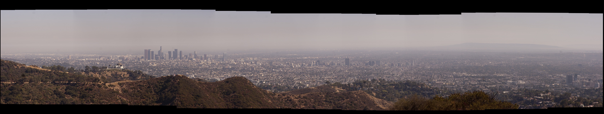

# Radial Stitcher (radStitch)



A simple panorama stitcher. Assumes input images are taken from radially symmetric viewpoints relative to common optical center--like the camera shown on the main page and like the Google Jump camera. Uses OpenCV feature description to generate matching landmarks between adjacent images. Requires OpenCV to be installed in order to compile. Works with OpenCV 3.1.0 installed on Ubuntu 16.04

<h3> Brief Usage (Ubuntu 16.04, OpenCV 3.1.0)</h3>
<i> You can probably massage this to run in Windows and macOS since using `cmake`, I haven't tried yet.</i>
<p>
To compile, make sure OpenCV is installed, and in a terminal, navigate to directory with `main.cpp` and `CMakeLists.txt`, run:
```
cmake .
```
Staying in the same directory, run:
```
make
```
After compilation, still in same directory, to stitch images, run:
```
./radStitch <image1> <image2> ... <imageN>
```
Test with images found in `/img/pano`
<p>
<i>Current constraints:</i>
<br>
Neighboring images specified in command line need to have an overlapping region i.e. `<imageK>` and `<imageK+1>` must share an overlapping region

<h3> // TODO </h3>
Currently works with images, will need to extend to video using `ffmpeg` or something
<br>
Need to implement polar wraparound
<br>
Code for parallel hardware, GPU
<br>
3D?
